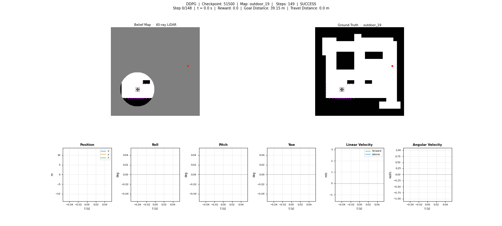

<div align="center">
  <h1>Quadcopter RL Off-Policy Velocity Control</h1>
  <h3>Multi-Critic Off-Policy Reinforcement Learning for Quadrotor Velocity Control in Unknown Indoor Environments</h3>
  
  [Ritabrata Chakraborty](https://ritabrata-chakraborty.github.io/Portfolio/), Kaushal Kishore
  
  <sup>BITS Pilani, CSIR-CEERI</sup>
  
  [](https://arxiv.org/abs/your-paper-url)&nbsp;

</div>

## Introduction

This work implements a hierarchical quadcopter-based indoor exploration framework with **off-policy reinforcement learning** for autonomous velocity-based point navigation in unknown indoor environments.

**Stage 1: Velocity-Based Point Navigation** trains an agent to directly control three velocity axes—forward, lateral, and angular—to navigate from arbitrary start positions to goal locations. The agent perceives the environment through a 360° LiDAR scan (40 binned rays) and observes the goal position and heading error. We investigate three off-policy algorithms (**TD3**, **DDPG**, **SAC**) and compare single-critic and **multi-critic reward decomposition** strategies.



**Stage 2: Frontier-Based Exploration** extends Stage 1 by using frontier detection to discover unexplored regions. A path to the selected frontier is planned via A* search and discretized into waypoints. The learned velocity controller from Stage 1 sequentially navigates waypoints, enabling robust exploration in maze-like environments. The framework gracefully handles dynamic obstacles and replans when paths become invalid.

## Control Architecture (Stage 1)

### Observation Space (45-dim)

The agent observes the environment through:
- **LiDAR**: 40 binned ray distances (normalized to [0, 1]) from a 360° scan
- **Goal Relative State**: Euclidean distance to goal (normalized), heading error to goal (in radians / π)
- **Action History**: Previous 3 normalized action values (forward, lateral, angular)

### Action Space (3-dim)

Normalized continuous actions in [−1, 1]:
- **Forward velocity**: $\dot{x}_{\text{cmd}} = \frac{a_0 + 1}{2} \cdot v_{\max}^x$ (range: [0, 3.0 m/s])
- **Lateral velocity**: $\dot{y}_{\text{cmd}} = a_1 \cdot v_{\max}^y$ (range: [−1.5, 1.5 m/s])
- **Angular velocity**: $\dot{\psi}_{\text{cmd}} = a_2 \cdot \omega_{\max}$ (range: [−60°, 60°]/s)

### Algorithms & Critic Strategies

We benchmark three off-policy algorithms with two critic architectures:

**Algorithms**: DDPG, TD3, SAC
**Replay Methods**: Uniform sampling or Prioritized Experience Replay (PER)
**Critic Architectures**: Single-critic baseline vs. multi-critic decomposition

### Single-Critic Baseline

A unified critic network outputs a single Q-value for the state-action pair. All reward shaping components are summed into a scalar step reward.

### Multi-Critic Decomposition (3 Specialized Critics)

Rather than a monolithic reward, the learning problem is decomposed into three domain-specific critics:

| Critic | Primary Objective | Reward Components |
|--------|-------------------|-------------------|
| **Critic 1** | Forward motion | $r_{\text{distance}}/2 + r_{\text{linear}}$ |
| **Critic 2** | Obstacle avoidance | $r_{\text{obstacle}} + r_{\text{lateral}}$ |
| **Critic 3** | Orientation alignment | $r_{\text{distance}}/2 + r_{\text{angular}} + r_{\text{yaw}}$ |

### Reward Shaping

**Step-wise rewards** at each timestep:
- **Distance progress**: $r_{\text{distance}} = \frac{2 d_0}{d_0 + d(t)} - 1$ (where $d_0$ = initial distance, $d(t)$ = current distance)
- **Yaw alignment**: $r_{\text{yaw}} = -|\theta_{\text{error}}|$ (heading error to goal in robot frame)
- **Linear speed penalty**: $r_{\text{linear}} = -\left(\frac{v_{\max}^x - v_{\text{cmd}}}{v_{\max}^x}\right)^2$ (encourages fast forward motion)
- **Lateral penalty**: $r_{\text{lateral}} = -a_1^2$ (discourages excessive lateral motion)
- **Angular penalty**: $r_{\text{angular}} = -a_2^2$ (discourages erratic rotations)
- **Obstacle proximity**: $r_{\text{obstacle}} = -20$ if min LiDAR distance < 1.0 m, else 0
- **Living cost**: $-1.0$ per step (single-critic) or $-1/3$ per critic (multi-critic)

**Terminal rewards** (episode end):
- **Success**: +2500 (goal reached within 1.0 m)
- **Collision**: −2000 (walls, out of bounds, or extreme tilt)
- **Timeout**: −100 (exceeded max episode steps)

## Features

- **Algorithms**: Off-Policy TD3, DDPG, SAC
- **Rollouts**: Ray Multi-Worker
- **Replay**: Uniform or Prioritized Experience Replay (PER)
- **Logging**: TensorBoard, Weights & Biases
- **Critics**: Single critic or multi-critic decomposition (forward, lateral, angular velocity)
- **Tasks**: Point goal navigation, frontier-based exploration

## Setup

### Conda (recommended)

From the repository root:

```bash
conda env create -f environment.yml
conda activate DRLNav
```

## Configuration (**`parameter.py`**)

| Area | Examples |
|------|----------|
| Experiment | `EXPERIMENT_NAME`, `EXPERIMENT_TYPE` (`TD3` / `DDPG` / `SAC`) |
| Directories | `CHECKPOINT_DIR`, `TENSORBOARD_DIR`, `TRAIN_PLOTS_DIR`, `EVAL_DIR` |
| Checkpointing | `LOAD_MODEL`, `CHECKPOINT_EVERY`, `SAVE_IMG_GAP`, `SUMMARY_WINDOW` |
| WandB | `WANDB_ENABLED`, `WANDB_PROJECT`, `WANDB_ENTITY` |
| Network | `NUM_SCAN_SAMPLES`, `STATE_SIZE`, `ACTION_SIZE`, `HIDDEN_SIZE` |
| Training | `MAX_EPISODE_STEP`, `REPLAY_SIZE`, `BATCH_SIZE`, `NUM_META_AGENT`, `LR`, `GAMMA`, `TAU` |
| TD3 | `POLICY_NOISE`, `POLICY_NOISE_CLIP`, `POLICY_UPDATE_FREQUENCY` |
| DDPG | `POLICY_UPDATE_FREQUENCY` |
| SAC | `LOG_STD_MIN`, `LOG_STD_MAX`, `SAC_ALPHA_INIT`, `SAC_ALPHA_LR`, `SAC_TARGET_ENTROPY` |
| OU Noise | `OU_NOISE_MAX_SIGMA`, `OU_NOISE_MIN_SIGMA`, `OU_NOISE_DECAY_EPISODES` |
| Environment | `PHYSICS_TS`, `DRL_STEP_DURATION`, `EPISODE_TIMEOUT`, `GOAL_THRESHOLD`, `HOVER_ALTITUDE` |
| Map | `TRAIN_MAPS_DIR`, `TRAIN_GOALS_DIR`, `EVAL_MAPS_DIR`, `EVAL_GOALS_DIR`, `MAP_CELL_SIZE`, `MAP_PIXELS` |
| Sensing | `SENSOR_RANGE`, `COLLISION_RADIUS` |
| Reward | `REWARD_SUCCESS`, `REWARD_CRASH`, `REWARD_TIMEOUT`, `OBSTACLE_PENALTY`, `OBSTACLE_PENALTY_THRESHOLD` |
| Velocity | `SPEED_LINEAR_MAX`, `SPEED_LINEAR_Y_MAX`, `SPEED_ANGULAR_MAX` |
| PER | `USE_PER`, `PER_ALPHA`, `PER_BETA_START`, `PER_BETA_FRAMES`, `PER_EPSILON` |
| GPU | `USE_GPU`, `USE_GPU_GLOBAL`, `NUM_GPU` |


## Dataset

Download pre-generated maps and goals:

```bash
bash dataset/download.sh
```

Or generate custom environments:

```bash
bash scripts/generate_worlds.sh
```

## Training

```bash
python3 driver.py
```

## Evaluation

```bash
python3 test.py
```

Replay recorded actions from evaluation step CSVs:

```bash
python3 test_3d.py <path-to-steps-csv>
```

## Repository Layout

```
Quadrotor-RL-Off-Policy-Velocity-Control/
├── parameter.py              # Hyperparameters and Paths
├── driver.py                 # Training Loop and Logging
├── runner.py                 # Ray Remote Runner
├── worker.py                 # Episode Rollouts
├── model.py                  # Actor/Critic Networks
├── agent.py                  # Action Selection and OU Noise
├── env.py                    # Navigation Environment
├── utils.py                  # State, Lidar, Buffers
├── test.py                   # Evaluation Runner
├── test_3d.py                # 3D Trajectory Replay
├── environment.yml           # Conda Environment
├── README.md
├── dataset/                  # Maps, Goals, World Generation
│   ├── colors.json
│   ├── colors.py
│   ├── download.sh
│   ├── world_gen/            # Generation Helpers
│   │   ├── goals.py
│   │   ├── simple.py
│   │   └── utils.py
│   ├── maps_train/           # Training Maps and Goals
│   └── maps_eval/            # Evaluation Maps and Goals
├── experiments/              # Experiment Outputs
│   └── <EXPERIMENT_NAME>/
│       ├── config.yaml
│       └── train/
│           ├── checkpoints/  # Model Checkpoints
│           ├── tensorboard/  # TensorBoard Logs
│           └── plots/
│               └── gifs/
├── Quadcopter_SimCon/        # Quadcopter Controller
├── scripts/                  # Utility Scripts
│   └── generate_worlds.sh
└── wandb/                    # Weights & Biases Logs
```

## Acknowledgments

This work builds upon the following foundational implementations:

- **Quadcopter Dynamics and Control**: [Quadcopter_SimCon](https://github.com/bobzwik/Quadcopter_SimCon)
- **Frontier-Based Exploration Framework**: [CogniPlan](https://github.com/marmotlab/CogniPlan)